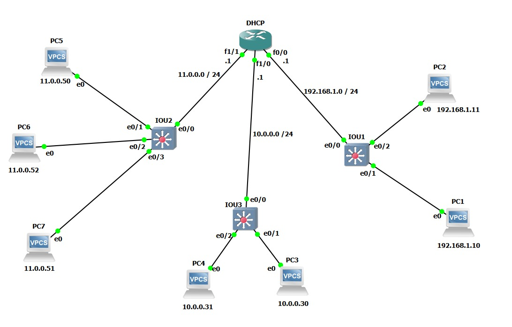
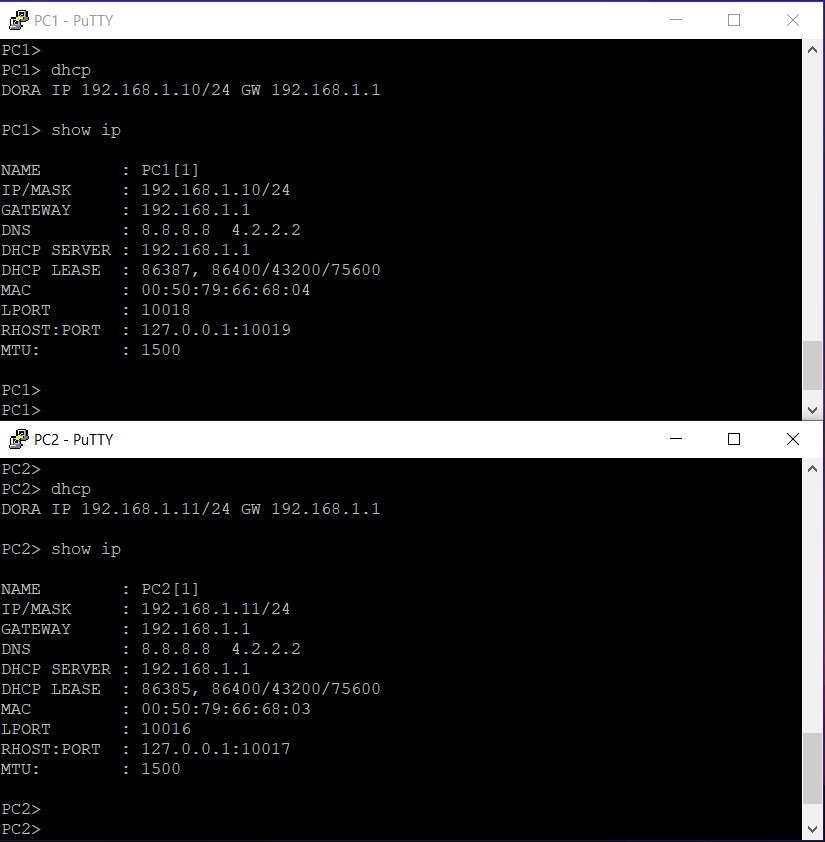
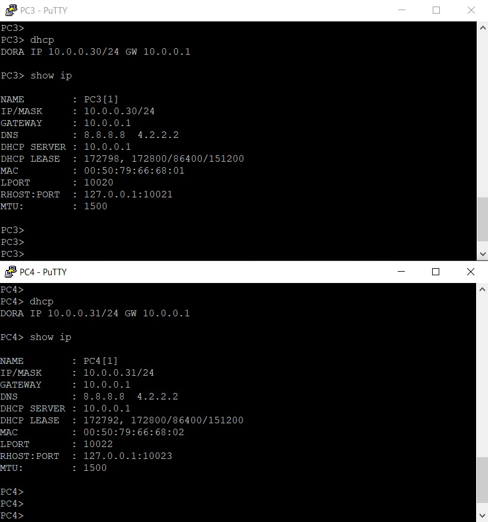
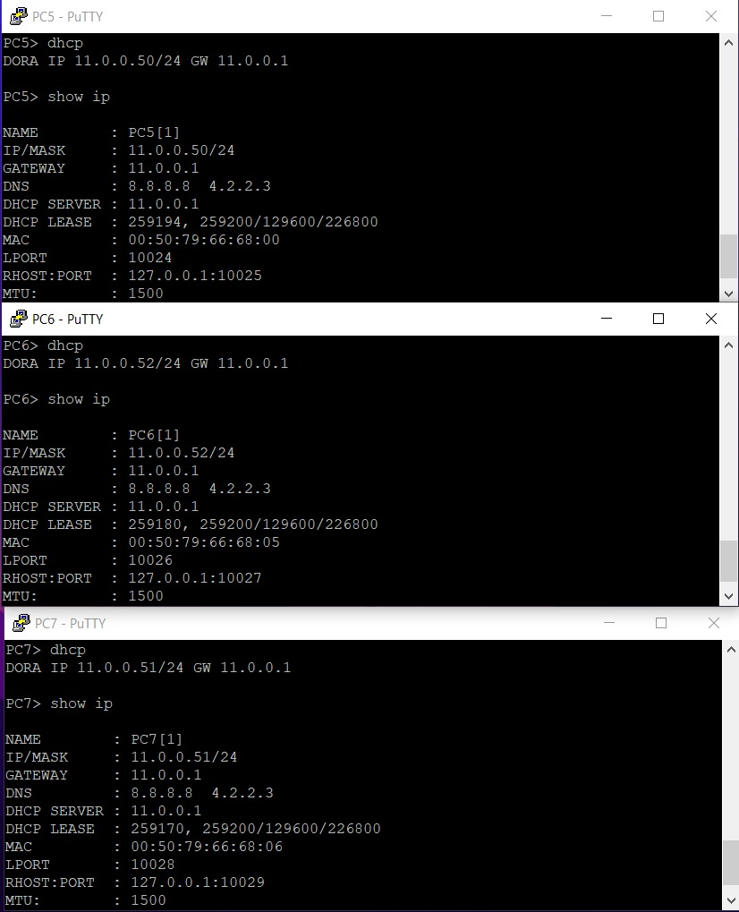

# Cisco DHCPv4 Multi-Subnet Layout & Routing Simulation

A verified networking lab demonstrating the deployment of a centralized Cisco IOS DHCPv4 Server routing across three distinct local area networks (LANs). Simulated effectively on GNS3.

## Topology Diagram

## Network Infrastructure Details

### 1. LAN1 (Right Subnet)
- **Interface:** FastEthernet 0/0 (`192.168.1.1/24`)
- **DHCP Pool Name:** `LAN1`
- **Network Scope:** `192.168.1.0/24`
- **Excluded Range:** `192.168.1.2` - `192.168.1.9`
- **DNS:** `8.8.8.8`, `4.2.2.2`

### 2. LAN2 (Middle Subnet)
- **Interface:** FastEthernet 1/0 (`10.0.0.1/24`)
- **DHCP Pool Name:** `LAN2`
- **Network Scope:** `10.0.0.0/24`
- **Excluded Range:** `10.0.0.2` - `10.0.0.29`
- **Lease Time:** 2 Days

### 3. LAN3 (Left Subnet)
- **Interface:** FastEthernet 1/1 (`11.0.0.1/24`)
- **DHCP Pool Name:** `LAN3`
- **Network Scope:** `11.0.0.0/24`
- **Excluded Range:** `11.0.0.0` - `11.0.0.49`
- **Lease Time:** 3 Days

---

## Configuration Verification

All VPCS endpoints across the subnets successfully initiate the DORA process to acquire respective IP configurations from the centralized DHCP router.

### LAN1 Verification (PC1 & PC2)

### LAN2 Verification (PC3 & PC4)

### LAN3 Verification (PC5, PC6 & PC7)

